# CODE笔记

# 绪论

## 注意

*   一刷主要是感受题目形式和思维，一道题不要拖太久
*   一定要**二刷**，到时候看看大家的做法，很多追求极致的思维非常牛逼，能学到很多东西！
    *   还有一些算法题需要数学证明

*   用助记符、口诀总结算法，归纳和复习很重要，理解大于记忆

## 数据结构与算法基础

知识框架

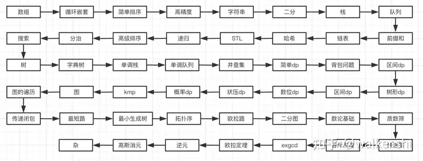

复杂度分析

## 参考资源

*   `LeetCode Wiki` https://doocs.github.io/leetcode/
*   算法通关手册 https://algo.itcharge.cn/
*   代码随想录
    *   题单网页 https://programmercarl.com/
    *   视频讲解 https://www.bilibili.com/video/BV1fA4y1o715
*   小浩算法 https://www.jishuchi.com/books/hello-algorithm
*   `hello-algo` https://github.com/krahets/hello-algo
*   oi竞赛wiki网站https://oi.wiki/
*   算法小炒（付费） https://labuladong.online/algo/home/
*   晴问，算法竞赛  https://sunnywhy.com/contests
*   知乎T大英伟达工程师的力扣题解
    *   https://github.com/wangsiping97/My-LeetCode-Solutions/tree/master
    *   你们初刷leetcode时会怀疑自己的智商吗？ - Johnny的回答 - 知乎
        https://www.zhihu.com/question/388971497/answer/1180277794
*   刷题策略 https://leetcode.cn/circle/discuss/jq9Zke/
*   Marty Lobdell - Study Less Study Smart 刷题方法论 https://leetcode.cn/circle/discuss/jq9Zke/
    *   https://www.youtube.com/watch?v=IlU-zDU6aQ0&t=793s
    *   Don't study for too long if you are not enjoying it. Take short breaks after 20-30 minutes. 
    *   Don't study in the living room, bedroom, etc. Study in a separate place dedicated to studying.
    *   Don't try to memorize without understanding. Try to understand the concept first. 
    *   Don't always study alone. Studying in groups helps a lot. 5. Don't highlight text blindly. Highlighting doesn't help that much. It only indicates Recognization not Recollection of the topic. 
    *   Always take notes. Reviewing the notes after a short time helps a lot. 
    *    Always try to teach others what you have learned. Teaching is the best way of learning. 
    *    Sleep is so much important for pushing something into your long-term memory. Get at least 7-8 hours of sound sleep. 
    *   Use the SQ3R(survey, question, recite, read, review) method while studying. 10. Use Mnemonics. It's the best way to memorize facts.


# 数组

*   C++求数组长度：数据类型`vector<int>& nums`用`nums.size();`

## 数组基础

## 数组排序

## 二分查找

## 双指针

*   代码随想录题单 双指针法#TODO

    *   移除元素

    *   反转字符串

    *   替换数字

    *   翻转字符串里的单词

    *   翻转链表

    *   删除链表的倒数第N个节点

    *   链表相交

    *   环形链表II

    *   三数之和

    *   四数之和

    *   滑动窗口

## 滑动窗口

## 前缀和


### [704.二分查找](https://leetcode.cn/problems/binary-search/)

*   取中间值更好的写法：

    `int mid = left + ((right - left) / 2);// 防止溢出 等同于(left + right)/2`

*   这道题根据区间的开闭有两种写法，我喜欢low、high指针都取到数组值的写法

```c++
class Solution {
public:
    int search(vector<int>& nums, int target) {
        int n = nums.size();
        int low = 0, high = n - 1;
        while( low <= high ){
            int mid = low + ((high - low) / 2);// 防止溢出 等同于(left + right)/2
            if( nums[mid] == target ) return mid;
            else if ( target > nums[mid] ){
                low = mid + 1;
            }else{
                high = mid - 1;
            }
        }
        return -1;
    }
};
```


### [27.移除元素](https://leetcode.cn/problems/remove-element/description/)

*   原地算法：https://baike.baidu.com/item/%E5%8E%9F%E5%9C%B0%E7%AE%97%E6%B3%95，空间复杂度O(1)

#### 双指针法（快慢指针）

*   这种方法太妙了！一定要掌握，对指针的使用！


```c++
// 时间复杂度：O(n)
// 空间复杂度：O(1)
class Solution {
public:
    int removeElement(vector<int>& nums, int val) {
        int n = nums.size(); // 不同元素数量，初始值为数组大小
        // 方法二：双指针
        /*
        通过快指针fast和慢指针slow在一个for循环下完成两个for循环的工作
        fast寻找不含val的数组新元素，所以判断条件是与val是否相等。
        slow指针指向可被覆盖的位置，以便前k个元素是想要的元素
        其中，if成立时，fast和slow指针同步移动
        */ 
        int slow = 0;
        for ( int fast = 0; fast < n; fast++ ){
            if ( val != nums[fast] ){ 
                nums[slow++] = nums[fast]; 
            }
        }
    return slow;
    }
};
```


#### 暴力解法：覆盖法


```c++
class Solution {
public:
    int removeElement(vector<int>& nums, int val) {
        int n = nums.size(); // 不同元素数量，初始值为数组大小
        // 暴力解法：
        // 采用覆盖的方法移除元素，所以每次循环范围缩小，后面的都是重复元素，不管就行了
        for ( int i = 0; i < n; i++ ){
            if( nums[i] == val ){ //这里用while超出时间限制，用if可以过！区别是if多写一句i--
                for( int j = i + 1; j < n; j++ ){
                    nums[j-1] = nums[j];
                }
                i--;
                n--;
            }
        }
        return n;
    }
};
```


### [977.有序数组的平方](https://leetcode.cn/problems/squares-of-a-sorted-array/description/)

*   #TODO 复习各种排序的实现：https://leetcode.cn/problems/squares-of-a-sorted-array/solutions/39242/ge-chong-pai-xu-shuang-zhi-zhen-by-toxic-3
*   写方法二的时候顺便复习了for循环的语法，执行流程、对应两个分号分出的三个位置的逻辑

#### 方法一：快慢指针，利用到有序这一性质

*   处理方式一：直接两头往中间比较
*   处理方式二：找到正负分界元素的位置，对两个数组进行归并排序


```c++
class Solution {
public:
    vector<int> sortedSquares(vector<int>& nums) {
        int n = nums.size();
        // 方法二：快慢指针
        vector<int> result(n, 0);
        int k = n - 1; // 在结果数组中指示保存位置
        for (int i = 0, j = n-1; i<=j; ){ // 细节：for循环的“改变”表达式写在内部
            if ( nums[i] * nums[i] < nums[j] * nums[j] ){
                result[k--] = nums[j] * nums[j];
                j--; 
            } else {
                result[k--] = nums[i] * nums[i];
                i++;
            }
        }
        return result;
    }
};
```


#### 方法二：平方后排序


```c++
class Solution {
public:
    vector<int> sortedSquares(vector<int>& nums) {
        int n = nums.size();
        //每个元素平方
        for ( int i = 0; i < n; i++ ){ 
            nums[i] *= nums[i];
        }

        //平方后的元素采用插入排序 
        // 可快速排序
        // sort(nums.begin(), nums.end());
        // return nums;

        int j, k, temp;
        for ( j = 1; j < n; j++ ){
            if ( nums[j] < nums[j-1] ){
                temp = nums[j];
                for ( k = j - 1; k >= 0 && nums[k] >temp; k-- ) nums[k+1] = nums[k];
                nums[k+1] = temp;
            }
        }
        return nums;
    }
};
```


### [209.长度最小的子数组](https://leetcode.cn/problems/minimum-size-subarray-sum/description/)

*   子数组是数组中**连续的非空**元素序列。

#### 方法一：滑动窗口

例，s=7， 数组是 2，3，1，2，4，3，查找过程：


```c++
class Solution {
public:
    int minSubArrayLen(int target, vector<int>& nums) {
        // 方法：滑动窗口
        int result = INT_MAX;
        int sum = 0; // 统计滑动窗口数值和
        int i = 0;
        int subLength = 0;
        for ( int j = 0; j < nums.size(); j++ ){
            sum += nums[j];
            while ( sum >= target ) {
                subLength = j - i + 1;
                result = result < subLength ? result : subLength;
                sum -= nums[i++]; // 滑动窗口就是先找到一个满足target的窗口，然后不断减小窗口，看最小满足
            }
        }
        return result == INT_MAX ? 0 : result;
    }
};
```

#### #TODO 方法二：前缀和+二分查找

>   首先，方法一采用暴力枚举，也是最清晰易懂的，我们以每个下标为出发点，搜遍所有区间。但是聪明的小朋友们发现，每个下标开始的这个遍历过程计算了很多重复的区间，比如1，2，3，4 。以1为下标时计算了+2、+3、+4 ; 以2为下标时计算了+3、+4，像这种避免区间和重复计算的优化方法，我们想到了前缀和，可以O(1)时间迅速得到任意区间的和问题。
>
>   然后 ，我们可以很容易得改良问题为 求s[j] - s[i] >=target ，可是这种做法如果不加改变，就是在前缀和数组上进行类似方法一的暴力枚举，枚举每一个i后面的下标j
>
>   最后，我们发现稍作变化，像这种线性的求值问题，联合二分查找可以做到求 s[j] >=s[i]+target.
>
>   由此引出前缀和+二分查找，官方解法可能确实没有将思路解释清楚，我们从优化遍历过程、避免重复计算的前缀和到二分，最好还是理清思考顺序，这样方便我们的举一反三，希望能帮到大家

```c++
class Solution {
public:
    int minSubArrayLen(int s, vector<int>& nums) {
        int n = nums.size();
        if (n == 0) {
            return 0;
        }
        int ans = INT_MAX;
        vector<int> sums(n + 1, 0); 
        // 为了方便计算，令 size = n + 1 
        // sums[0] = 0 意味着前 0 个元素的前缀和为 0
        // sums[1] = A[0] 前 1 个元素的前缀和为 A[0]
        // 以此类推
        for (int i = 1; i <= n; i++) {
            sums[i] = sums[i - 1] + nums[i - 1];
        }
        for (int i = 1; i <= n; i++) {
            int target = s + sums[i - 1];
            auto bound = lower_bound(sums.begin(), sums.end(), target);
            if (bound != sums.end()) {
                ans = min(ans, static_cast<int>((bound - sums.begin()) - (i - 1)));
            }
        }
        return ans == INT_MAX ? 0 : ans;
    }
};
```


#### 方法三：暴力解

```c++
class Solution {
public:
    int minSubArrayLen(int target, vector<int>& nums) {
        // (会超出时间限制的解法，仅学习用)方法一：暴力解法，字符串暴力匹配的思维
        int n = nums.size();
        if( n==0 ) return 0;
        int ans = INT_MAX;

        // 子数组是连续非空序列，要注意读题
        for ( int i = 0; i < n; i++ ){ // 遍历所有可能的子数组，发现最小长度的那个
            int sum = 0;
            for ( int j = i; j < n; j++){
                sum += nums[j];
                if ( sum >= target ) {
                    ans = min( ans, j - i + 1); // 也可用“:?”表达式实现
                    break;
                }
            }
        }
        return ans == INT_MAX ? 0 : ans;

    }
};
```


### [59.螺旋矩阵II](https://leetcode.cn/problems/spiral-matrix-ii/description/)

*   跑一段直线到头削掉一层，这样的思路最清晰简洁

```c++
class Solution {
public:
    vector<vector<int>> generateMatrix(int n) {
        // // 跑一段直线到头削掉一层，循环处理四次，将k*k个数字刚好填满
        int t = 0; // top
        int b = n - 1; // bottom
        int l = 0; // left
        int r = n - 1; // right
        vector<vector<int>> ans(n, vector<int>(n));
        int k = 1;
        while (k <= n*n ){ // 这里的自增运算符两种写法都可无影响，不过看到很多题解习惯写成"++i, --j"的形式
            // for left to right, generate in top
            for ( int i = l; i <=r; i++, k++ ) ans[t][i] = k;
            t++; 
            // from top to bottom, generate in right
            for ( int i = t; i <= b; i++, k++ ) ans[i][r] = k;
            r--;
            // from right to left, generate in bottom
            for ( int i = r; i >= l; i--, k++ ) ans[b][i] = k; // 注意循环方向与前面不一样，判断和i都要变
            b--;
            // from bottom to top, generate in left
            for ( int i = b; i >= t; i--, k++ ) ans[i][l] = k;
            l++;
        }
        return ans;
    }
};
```


### [58. 区间和](https://kamacoder.com/problempage.php?pid=1070)


###  44. 开发商购买土地


# 链表

## 链表的排序


## 链表的双指针


### [203.移除链表元素](https://leetcode.cn/problems/remove-linked-list-elements/description/)

#### 方法一：迭代，设置虚拟头节点

*   complexity
    *   T = O(n)
    *   S = O(n)

```c++
/**
 * Definition for singly-linked list.
 * struct ListNode {
 *     int val;
 *     ListNode *next;
 *     ListNode() : val(0), next(nullptr) {}
 *     ListNode(int x) : val(x), next(nullptr) {}
 *     ListNode(int x, ListNode *next) : val(x), next(next) {}
 * };
 */
class Solution {
public:
    ListNode* removeElements(ListNode* head, int val) {
        ListNode* dummyHead = new ListNode(0); // 设置虚拟头结点，可统一处理链表所有元素
        dummyHead->next = head;
        ListNode* p = dummyHead; // p为工作指针，判断是否为指定元素，相当于for循环的i变量
        while( p->next != NULL ){
            if ( p->next->val == val ){
                ListNode *q = p->next; // q为工作指针，用来删除结点，释放空间
                p->next = p->next->next; //
                delete q;
            } else {
                p = p->next;
            }
        }
        head = dummyHead->next;
        delete dummyHead;
        return head;
    }
};
```


#### [方法二：递归](https://leetcode.cn/problems/remove-linked-list-elements/solutions/341875/203-yi-chu-lian-biao-yuan-su-you-ya-di-gui-c-yu-ya) 

*   递归处理删除结点，从尾部开始不断返回，如果head->val == val，说明需要删除当前结点，返回head->next链接到上一层递归，否则不断返回当前head
*   链表拆解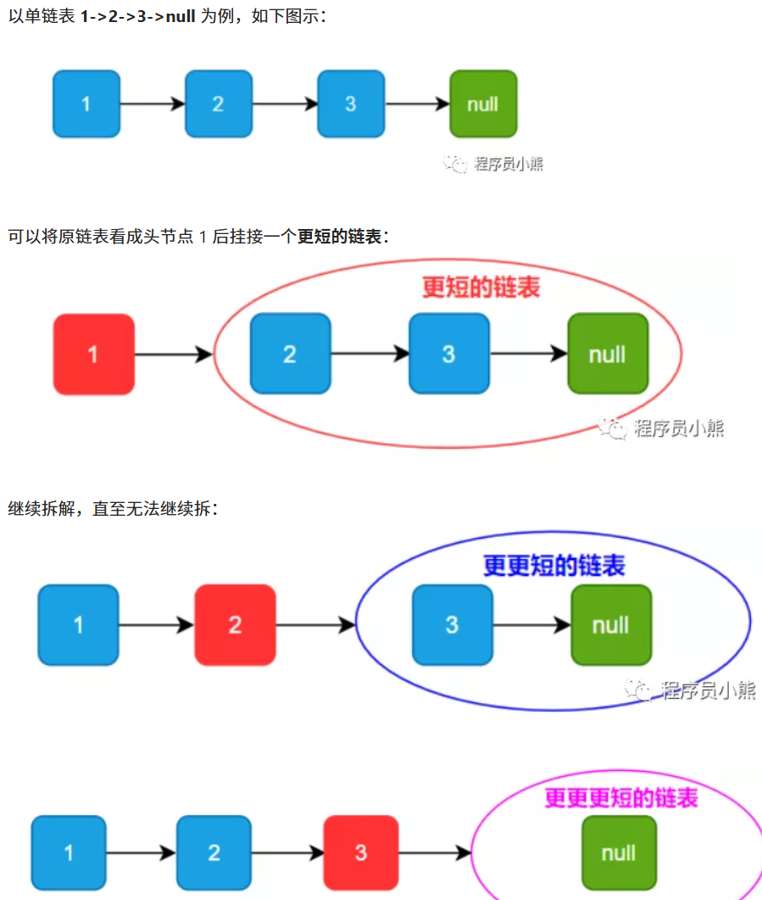
*   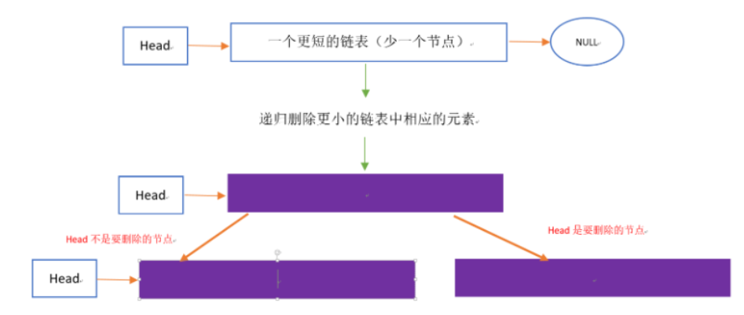
*   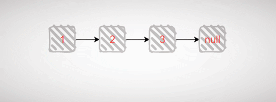
*   复杂度分析
    *   T = O(n)
    *   S = O(n)


```c++
// 理解性写法
struct ListNode* removeElements(struct ListNode* head, int val){ 
    if (NULL == head) {
        return head;
    }     

    /* 删除头节点后所有值为 val 的节点 */
    struct ListNode* res = removeElements(head->next, val);

    /* 头节点是待删除的节点 */
    if (head->val == val) {
        return res;
    /* 头节点不是待删除的节点，头节点后面挂接已处理的链表（更短的） */
    } else {
        head->next = res;
        return head;
    }
}

// 简约写法
class Solution {
public:
    ListNode* removeElements(ListNode* head, int val) {
        if (head == nullptr) {
            return head;
        }
        head->next = removeElements(head->next, val);
        return head->val == val ? head->next : head;
    }
};
```

### [707.设计链表](https://leetcode.cn/problems/design-linked-list/)

*   训练链表常见的6个操作
*   复杂度分析
    *   T_n = O(index)、O(1)
    *   S_n = O(1)

```c++
class MyLinkedList {
public:
    // 出于方便，没有对所有节点进行手动释放内存的管理，不影响空间复杂度
    // define linkedList Node
    // 力扣默认用ListNode定义了结点，这一块可以不写，前面的题注释中可以看到：
    /**
    * Definition for singly-linked list.
    * struct ListNode {
    *     int val;
    *     ListNode *next;
    *     ListNode() : val(0), next(nullptr) {}
    *     ListNode(int x) : val(x), next(nullptr) {}
    *     ListNode(int x, ListNode *next) : val(x), next(next) {}
    * };
    */
    struct ListNode{
        int val;
        ListNode* next;
        ListNode(int val):val(val), next(nullptr){}
    };

    // initialize list
    MyLinkedList() {
        _dummyHead = new ListNode(0);
        _size = 0;
    }
    // index from 0
    int get(int index) {
        if ( index > (_size - 1 ) || index < 0 ) return -1;
        ListNode* p = _dummyHead->next; // p结点，遍历链表
        while ( index-- ) p = p->next; // 先使用index，然后自减
        return p->val;
    }
    // insert a node at the head
    void addAtHead(int val) {
        ListNode* newNode = new ListNode(val);
        newNode->next = _dummyHead->next;
        _dummyHead->next = newNode;
        _size++;
    }

    // insert a node at the tail
    void addAtTail(int val) {
        ListNode* newNode = new ListNode(val);
        ListNode* p = _dummyHead;
        while ( p->next != nullptr ) p = p->next;
        p->next = newNode;
        _size++;
    }
    
    void addAtIndex(int index, int val) {
        if ( index > _size ) return;
        if ( index < 0 ) index = 0;
        ListNode* newNode = new ListNode(val);
        ListNode* p = _dummyHead;
        while ( index-- ) p = p->next;
        newNode->next = p->next;
        p->next = newNode;
        _size++;
    }
    
    void deleteAtIndex(int index) {
        if ( index >= _size || index < 0 ) return;
        ListNode* p = _dummyHead;
        while ( index-- ) p = p->next;
        ListNode* q = p->next; // 指向被删除结点
        p->next = p->next->next;
        delete q;
        q = nullptr; //释放q的内存之后，让其指向空，在这个作用域下更稳妥
        _size--;
    }

    // 打印链表（额外学习）
    /*
    void printLinkedList(){
        ListNode* p = _dummyHead;
        while ( p->next != nullptr ) {
            cout << p->next->val << " ";
            p = p->next;
        }
        cout << endl;
    }
    */
    
private:
    int _size;
    ListNode* _dummyHead;
};

/**
 * Your MyLinkedList object will be instantiated and called as such:
 * MyLinkedList* obj = new MyLinkedList();
 * int param_1 = obj->get(index);
 * obj->addAtHead(val);
 * obj->addAtTail(val);
 * obj->addAtIndex(index,val);
 * obj->deleteAtIndex(index);
 */
```


### [206. Reverse Linked List ](https://leetcode.cn/problems/reverse-linked-list/)

*   Given the `head` of a singly linked list, reverse the list, and return *the reversed list*.

```c++
/**
 * Definition for singly-linked list.
 * struct ListNode {
 *     int val;
 *     ListNode *next;
 *     ListNode() : val(0), next(nullptr) {}
 *     ListNode(int x) : val(x), next(nullptr) {}
 *     ListNode(int x, ListNode *next) : val(x), next(next) {}
 * };
 */
class Solution {
public:
    ListNode* reverseList(ListNode* head) {
        ListNode* pre = nullptr, *cur = head;
        while ( cur ){
            ListNode* tmp = cur->next;
            cur->next = pre;
            pre = cur;
            cur = tmp;
            // 用了三个指针实现倒置，每次翻转链表后，三个指针整体后移
        }
        return pre;
    }
};
```

*   方法二：递归法(还没消化)

```c++
class Solution {
public:
    ListNode* reverseList(ListNode* head) {
        // 边缘条件判断
        if(head == NULL) return NULL;
        if (head->next == NULL) return head;
        
        // 递归调用，翻转第二个节点开始往后的链表
        ListNode *last = reverseList(head->next);
        // 翻转头节点与第二个节点的指向
        head->next->next = head;
        // 此时的 head 节点为尾节点，next 需要指向 NULL
        head->next = NULL;
        return last;
    }
}; 
```


### [24. Swap Nodes in Pairs](https://leetcode.cn/problems/swap-nodes-in-pairs/)

*   Given a linked list, swap every two adjacent nodes and return its head. You must solve the problem without modifying the values in the list's nodes (i.e., only nodes themselves may be changed.)

模拟法

*   解题模拟时：循环链表，用两个工作指针**记住当前cur指针的下一个和下下下一个位置**（相对0位的1和3位），按步骤三次完成交换，之后移动cur判断是否为空，不空时重复交换，直到为空时退出循环。返回虚拟头结点指向的真正头结点，释放虚拟头结点。

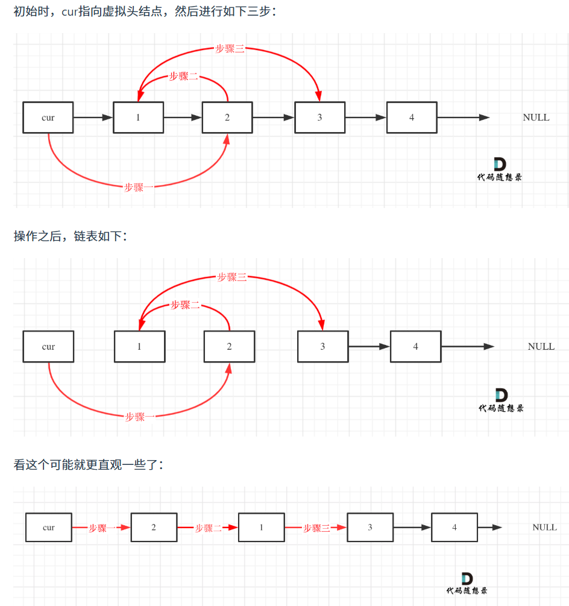

复杂度

T=O(n), S=O(1)

```c++
/**
 * Definition for singly-linked list.
 * struct ListNode {
 *     int val;
 *     ListNode *next;
 *     ListNode() : val(0), next(nullptr) {}
 *     ListNode(int x) : val(x), next(nullptr) {}
 *     ListNode(int x, ListNode *next) : val(x), next(next) {}
 * };
 */
class Solution {
public:
    ListNode* swapPairs(ListNode* head) {
        ListNode* dummyHead = new ListNode(0, head); 
        // ListNode(int x, ListNode *next) : val(x), next(next) {}
        ListNode* cur = dummyHead;
        while ( cur->next != nullptr && cur->next->next != nullptr ) {
            // 链表经典处理：用两个以上的工作指针
            ListNode* tmp1 = cur->next; 
            ListNode* tmp2 = cur->next->next->next;
            // three steps to swap two adjacent nodes in pairs
            // 1
            cur->next = cur->next->next;
            // 2
            cur->next->next = tmp1;
            // 3
            cur->next->next->next = tmp2;

            // update for next swap
            cur = cur->next->next;
        }
        ListNode* res = dummyHead->next;
        delete dummyHead;
        return res;
    }
};
```


[递归（评论区看的，还没消化，评论区还有更多）](https://leetcode.cn/problems/swap-nodes-in-pairs/solutions/)

```
class Solution {
public:
    ListNode* reverse(ListNode* pre) {
        if (pre == nullptr) {//当最后一次递归一个元素也没有
            return nullptr;
        } else if (pre->next == nullptr) {
            return pre;//最后一次递归 还剩下一个元素 那么直接返回即可
        }
        ListNode* cur = pre->next;
        ListNode* tmp = cur->next;
        cur->next = pre;
        pre->next = reverse(tmp);//传入pre指针 
        return cur;
    }
    ListNode* swapPairs(ListNode* head) {
        // 递归法解决
        if (head == nullptr)
            return nullptr;
        if (head->next == nullptr)
            return head;
        return reverse(head);
    }
};
```


### [19. Remove Nth Node From End of List](https://leetcode.cn/problems/remove-nth-node-from-end-of-list/)

Given the `head` of a linked list, remove the `nth` node from the end of the list and return its head.

经典的快慢指针策略，快指针先移动“n”步，然后快慢开始同时移动——使得当快指针移动到表尾的时候，慢指针移动到要删除节点的上一个节点处。

细节：从虚拟头结点开始处理，无脑将操作统一化，不必担心头结点，最后再释放就可；移动n或者n+1步，这取决于用快指针还是其next判断循环终止

复杂度：T=O(L)；S=O(1) L为链表长度

```c++
/**
 * Definition for singly-linked list.
 * struct ListNode {
 *     int val;
 *     ListNode *next;
 *     ListNode() : val(0), next(nullptr) {}
 *     ListNode(int x) : val(x), next(nullptr) {}
 *     ListNode(int x, ListNode *next) : val(x), next(next) {}
 * };
 */
class Solution {
public:
    ListNode* removeNthFromEnd(ListNode* head, int n) {
        /*
        Constraints:
        The number of nodes in the list is sz.
        1 <= sz <= 30
        0 <= Node.val <= 100
        1 <= n <= sz
       由上述约束可知，不用考虑n超出范围，快指针移动可以用for或while，我更喜欢for
       */
        ListNode* dummyHead = new ListNode(0, head);
        ListNode* slow = dummyHead;
        ListNode* fast = dummyHead;
        // 在 C++ 中，通常推荐使用 ++i，尤其是在涉及迭代器或复杂对象时。
        // ++i 和 i++ 的区别：在 for 循环中，两者效果相同，但 ++i 更推荐使用。
        for ( int i = 0; i < n && fast != nullptr; ++i ) {
            fast = fast->next;
        }
        // 这里代码细节有多种：最终是为了让fast和slow的距离为n+1，在for或者while或者两者之间处理都可
        while ( fast->next ) {
        // while ( fast ) 这样写是错的
            fast = fast->next;
            slow = slow->next;
        }
        // delete && free memory space
        ListNode* tmp = slow->next;
        slow->next = tmp->next;
        delete tmp;

        return dummyHead->next;
    }
};
```


更多解法见[题解](https://leetcode.cn/problems/remove-nth-node-from-end-of-list/solutions/450350/shan-chu-lian-biao-de-dao-shu-di-nge-jie-dian-b-61)


### [160./面试题02.07. Intersection of Two Linked Lists LCCI](https://leetcode.cn/problems/intersection-of-two-linked-lists-lcci/)

>   160.链表相交

*   Given two (singly) linked lists, determine if the two lists intersect. Return the inter­ secting node. Note that the intersection is defined based on reference, not value. That is, if the kth node of the first linked list is the exact same node (by reference) as the jth node of the second linked list, then they are intersecting.


方法一：尾部对齐后逐个比较

O(m+n)，O(1)

```c++
/**
 * Definition for singly-linked list.
 * struct ListNode {
 *     int val;
 *     ListNode *next;
 *     ListNode(int x) : val(x), next(NULL) {}
 * };
 */
class Solution {
public:
    ListNode *getIntersectionNode(ListNode *headA, ListNode *headB) {
        // 思路：尾部对齐后，开始比较
        // 这里其实可以写一个getlen函数
        ListNode* curA = headA, *curB = headB;
        int lenA = 0, lenB = 0;
        // get len
        while ( curA != NULL ) {
            lenA++;
            curA = curA->next;
        }
        while ( curB != NULL ) {
            lenB++;
            curB = curB->next;
        }
        // curA curB为工作指针，重新用起来，链表基本：通过两个工作指针有条理地完成各种操作
        curA = headA;
        curB = headB;
        // 确定A为长链表，B为短的，对齐处理后，更方便，这种思维非常实用！
        if ( lenB > lenA ) {
            swap ( lenA, lenB );
            swap ( curA, curB );
        }
        int gap = lenA - lenB;
        while ( gap-- ) curA = curA->next; // align A and B
        while ( curA != NULL ) {
            if ( curA == curB ) return curA;
            curA = curA->next;
            curB = curB->next;
        }
        return NULL;
    }
};
```


方法二：数学分析后，双指针

O(m+n)，O(1)

*   理解：两个链表分别由A、B两个指针走，速度相同，要发现共同的结点
    *   要么是方法一中的尾部对齐，由长的链表的指针先走到与B指针同步的位置，然后一起比较出共同的结点；
    *   要么是分别给两个链表补充对方，使得起点相同，每个指针在A+B的长度下比较，可以直接比较也可以用栈

https://leetcode.cn/problems/intersection-of-two-linked-lists-lcci/solutions/1190240/mian-shi-ti-0207-lian-biao-xiang-jiao-sh-b8hn

>   可以理解成两个人速度一致， 走过的路程一致。那么肯定会同一个时间点到达终点。如果到达终点的最后一段路两人都走的话，那么这段路上俩人肯定是肩并肩手牵手的
>
>   他朝若是同淋雪，此生也算共白头


```c++
class Solution {
public:
    ListNode *getIntersectionNode(ListNode *headA, ListNode *headB) {
        ListNode *A = headA, *B = headB;
        while (A != B) {
            A = A != nullptr ? A->next : headB;
            B = B != nullptr ? B->next : headA;
        }
        return A;
    }
};
```


### [142. Linked List Cycle II](https://leetcode.cn/problems/linked-list-cycle-ii/)

*   Given the `head` of a linked list, return *the node where the cycle begins. If there is no cycle, return* `null`.

    There is a cycle in a linked list if there is some node in the list that can be reached again by continuously following the `next` pointer. Internally, `pos` is used to denote the index of the node that tail's `next` pointer is connected to (**0-indexed**). It is `-1` if there is no cycle. **Note that** `pos` **is not passed as a parameter**.

    **Do not modify** the linked list.

*   算法思路：

    *   快指针追慢指针，每次多追一步，最后在环中追上，n(y+z)是因为x足够长时，slow要慢慢进入环中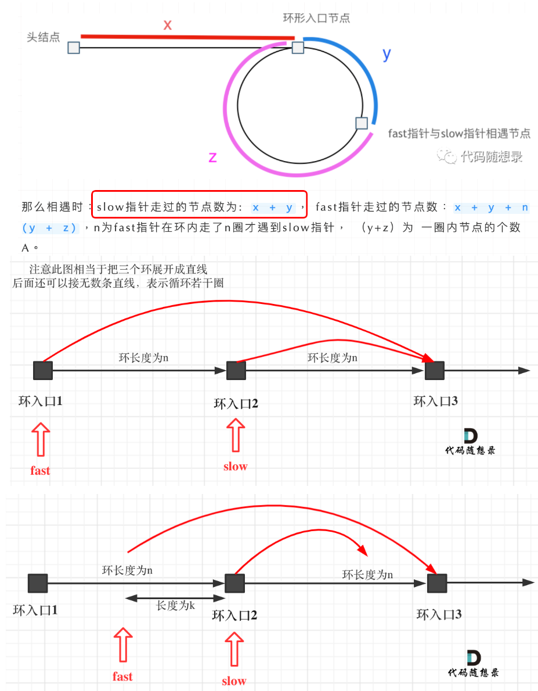
    *   两个指针走过的结点数满足2倍的等式关系：$(x+y)*2 = x+y+n(y+z)$，化简整理有$x = (n - 1) (y + z) + z$
    *   从而可知，环的入口确定方法为两个指针分别从开始和相遇节点处出发，相遇时即为环形入口结点
    *   T=O(n);S=O(1)

```c++
/**
 * Definition for singly-linked list.
 * struct ListNode {
 *     int val;
 *     ListNode *next;
 *     ListNode(int x) : val(x), next(NULL) {}
 * };
 */
class Solution {
public:
    ListNode *detectCycle(ListNode *head) {
        // 两个子问题：1、判断是否有环；2、如果有环，其入口在哪
        ListNode*  fast = head, *slow = head;
        while ( fast != nullptr ) {
            if ( fast->next == nullptr ) return nullptr;
            fast = fast->next->next;
            slow = slow->next;
            if ( slow == fast ) {
                // find the cycle's enterance
                ListNode* index1 = head, *index2 = fast;
                while ( index1 != index2 ) {
                    index1 = index1->next;
                    index2 = index2->next;
                }
                return index1;
            }
        }
        return nullptr;
    }
};
```


方法二：哈希表

用哈希记录visited，可能对思维要求更低些


# 哈希表

## 哈希表基础

### 哈希冲突

### 哈希算法

*   拉链法处理哈希冲突


### [242. Valid Anagram](https://leetcode.cn/problems/valid-anagram/)

>   有效的字母异位词

*   Given two strings `s` and `t`, return `true` if `t` is an anagram of `s`, and `false` otherwise.
    *   An anagram is a word or phrase formed by rearranging the letters of a different word or phrase, using all the original letters exactly once.

方法一：排序后逐个比较

复杂度主要来源于排序方式，C++的sort使用的是快排

```c++
class Solution {
public:
    bool isAnagram(string s, string t) {
        // 方法一：排序后比较
        if ( s.length() != t.length() ) return false;
        sort( s.begin(), s.end() ); // 快排
        sort( t.begin(), t.end() );
        return s == t;
        // T=O(nlogn), S=O(logn) 
    }
};
```


方法二：用数组实现hash记录访问情况，a-z共26个位置

T=O(n)，S=O(string)=O(1)，string为字符串的定义域：哈希表大小，此处为26

```c++
class Solution {
public:
    bool isAnagram(string s, string t) {
        // 方法二：哈希记录visit情况
        int record[26] = {0};
        // 定义哈希函数：连续的空间，参考直接定址法：取相对位置处理
        for ( int i = 0; i < s.size(); ++i ) record[s[i] - 'a']++;
        for ( int i = 0; i < t.size(); ++i ) record[t[i] - 'a']--; 
        // tranverse 
        for ( int i = 0; i < 26; ++i ) {
            if( record[i] != 0 ) return false;
        }
        return true;
    }
};
```


### [349. Intersection of Two Arrays](https://leetcode.cn/problems/intersection-of-two-arrays/)

>   两个数组的交集

*   Given two integer arrays `nums1` and `nums2`, return *an array of their intersection*. Each element in the result must be **unique** and you may return the result in **any order**.
    *   The intersection of two arrays is defined as the set of elements that are present in both arrays.


用set实现哈希——C++ 给提供了如下三种可用的数据结构：

*   std::set
*   std::multiset
*   std::unordered_set

std::set和std::multiset底层实现都是红黑树，std::unordered_set的底层实现是哈希表， 使用unordered_set 读写效率是最高的，并不需要对数据进行排序，而且还不要让数据重复，所以选择unordered_set。

思路如图所示：


*   时间复杂度: O(n + m) m 是最后要把 set转成vector；空间复杂度: O(n)

```c++
class Solution {
public:
    vector<int> intersection(vector<int>& nums1, vector<int>& nums2) {
        unordered_set<int> result_set; // store result that don't have same number 
        unordered_set<int> nums_set( nums1.begin(), nums1.end() );

        for ( int num : nums2 ) { // 遍历容器（如数组、向量等）中的每一个元素
            if ( nums_set.find(num) != nums_set.end() ) result_set.insert( num );
        }
        return vector<int>( result_set.begin(), result_set.end() );
    }
};
```


使用技巧 nums_set

`nums_set` 是一个 **`std::unordered_set<int>`** 类型的变量，它是 C++ 标准库中的一个容器，用于存储一组唯一的、无序的整数

```c++
#include <iostream>
#include <unordered_set>
#include <vector>

int main() {
    std::vector<int> nums1 = {1, 2, 2, 3, 4, 4, 5};

    // 使用 nums1 初始化 nums_set
    std::unordered_set<int> nums_set(nums1.begin(), nums1.end());

    // 输出 nums_set 中的元素
    std::cout << "nums_set 中的元素: ";
    for (int num : nums_set) {
        std::cout << num << " ";
    }
    std::cout << std::endl;

    // 查找元素
    if (nums_set.find(3) != nums_set.end()) {
        std::cout << "3 存在于 nums_set 中" << std::endl;
    }

    // 插入元素
    nums_set.insert(6);
    std::cout << "插入 6 后，nums_set 中的元素: ";
    for (int num : nums_set) {
        std::cout << num << " ";
    }
    std::cout << std::endl;

    // 删除元素
    nums_set.erase(4);
    std::cout << "删除 4 后，nums_set 中的元素: ";
    for (int num : nums_set) {
        std::cout << num << " ";
    }
    std::cout << std::endl;

    return 0;
}


```

输出结果

```
nums_set 中的元素: 5 4 3 2 1 
3 存在于 nums_set 中
插入 6 后，nums_set 中的元素: 6 5 4 3 2 1 
删除 4 后，nums_set 中的元素: 6 5 3 2 1 
```

nums_set不是特殊用法，它就是一个变量名。

1.  命名方面：

```
// 以下命名都是合法的，效果相同
unordered_set<int> nums_set;
unordered_set<int> mySet;
unordered_set<int> s;
```

1.  常见的构造方式：

```
// 方式1：空集合
unordered_set<int> set1;

// 方式2：使用迭代器范围构造（你看到的这种方式）
vector<int> vec = {1,2,3};
unordered_set<int> set2(vec.begin(), vec.end());

// 方式3：初始化列表
unordered_set<int> set3 = {1,2,3,4,5};

// 方式4：拷贝构造
unordered_set<int> set4(set3);
```

1.  使用示例：

```
unordered_set<int> nums_set;
// 插入元素
nums_set.insert(1);

// 查找元素
if(nums_set.find(1) != nums_set.end()) {
    cout << "Found 1" << endl;
}

// 删除元素
nums_set.erase(1);

// 获取大小
int size = nums_set.size();
```

所以nums_set只是一个普通的变量名，你完全可以按照自己的命名习惯来命名。关键是要理解unordered_set这种容器的特性：

*   元素唯一
*   无序存储
*   查找效率O(1)
*   常用于去重和快速查找场景

### [202. Happy Number](https://leetcode.cn/problems/happy-number/)

*   Write an algorithm to determine if a number `n` is happy.

    A **happy number** is a number defined by the following process:

    *   Starting with any positive integer, replace the number by the sum of the squares of its digits.
    *   Repeat the process until the number equals 1 (where it will stay), or it **loops endlessly in a cycle** which does not include 1.
    *   Those numbers for which this process **ends in 1** are happy.

    Return `true` *if* `n` *is a happy number, and* `false` *if not*.

解题关键：意识到求和的过程中，sum会重复出现，要么发现1判定为happy，要么sum重复出现，判定`false`

解法一：哈希

T=S=o(logn)

```c++
class Solution {
public:
    int getSum( int n ) {
        int sum = 0;
        while ( n ) {
            sum += ( n % 10 ) * ( n % 10 );
            n /= 10;
        }
        return sum;
    }
    bool isHappy(int n) {
        // 无限循环==>sum会重复出现，官方题解可证
        // 判断在下一次进入sum循环之前是否出现1，用哈希或者快慢指针
        unordered_set<int> set;
        while ( 1 ) {
            int sum = getSum(n);
            if ( sum == 1 ) return true;
            if ( set.find(sum) != set.end() ) {
                return false;
            } else {
                set.insert( sum );
            }
            n = sum;
        }
    }
};
```


解法二：快慢指针，同链表142 https://leetcode.cn/problems/happy-number/solutions/224894/kuai-le-shu-by-leetcode-solution


### [1. Two Sum](https://leetcode.cn/problems/two-sum/)

*   Given an array of integers `nums` and an integer `target`, return *indices of the two numbers such that they add up to `target`*.

    You may assume that each input would have ***exactly\* one solution**, and you may not use the *same* element twice.

    You can return the answer in any order.

| 题目                 | 解决哈希问题的数据结构 |
| -------------------- | ---------------------- |
| 242.有效的字母异位词 | array                  |
| 349.两个数组的交集   | set                    |
| 1.Two Sum            | map                    |

*   map中的存储结构为 **{key：数据元素，value：数组元素对应的下标}**。
*   在遍历数组的时候，只需要向map去查询是否有和目前遍历元素匹配的数值，如果有，就找到的匹配对，如果没有，就把目前遍历的元素放进map中——map存放的就是我们访问过的元素。
*   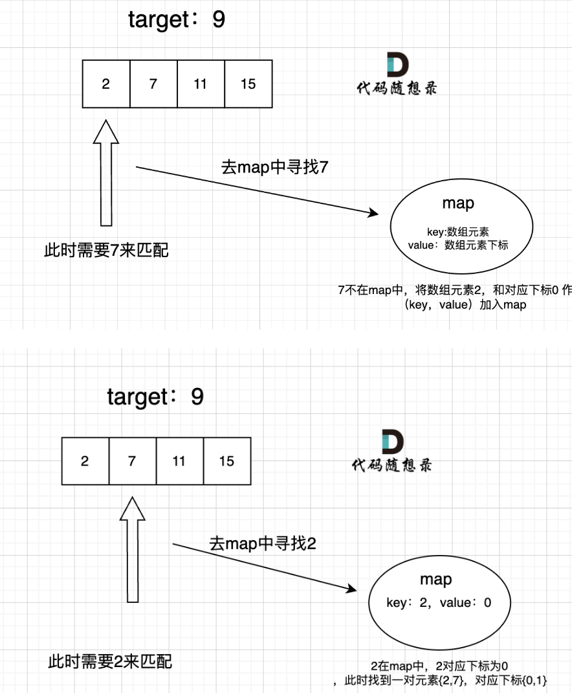

T=O(n), S=O(n)

```c++
class Solution {
public:
    vector<int> twoSum(vector<int>& nums, int target) {
        std::unordered_map <int, int> map;
        for ( int i = 0; i < nums.size(); ++i ) {
            auto iter = map.find( target - nums[i] );
            /*
            对于 map/unordered_map，迭代器指向的是一个键值对访问键值对的方法：
            it->first：访问键（key）
            it->second：访问值（value）
            */ 
            if ( iter != map.end() ) return { iter->second, i };
            map.insert( pair<int, int>( nums[i], i ));
        }
        return {};
    }
};
```


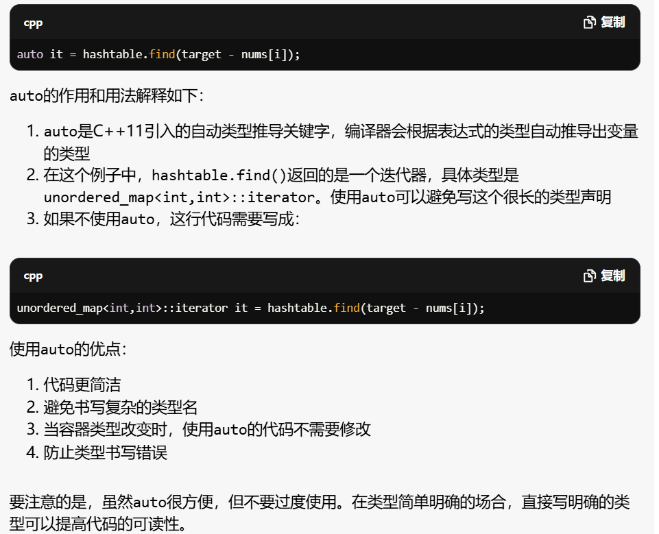


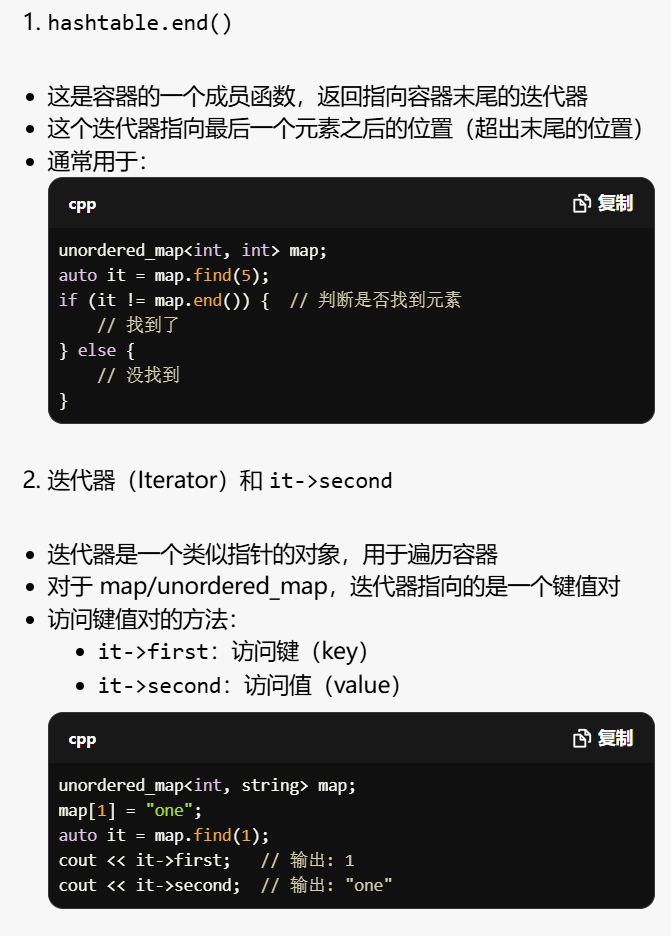


### [454. 四数相加 II](https://leetcode.cn/problems/4sum-ii/)


思考过程——

角度一，直接思考法：多数组问题由二数组解决，就像多分类到二分类，树与二叉树，二项分布与0-1分布等等的关系

角度二，由题目模拟推理：

```markdown
1. 一采用分为两组，HashMap 存一组，另一组和 HashMap 进行比对。

2. 这样的话情况就可以分为三种：
	* HashMap 存一个数组，如 A。然后计算三个数组之和，如 BCD。时间复杂度为：O(n)+O(n^3)，得到 O(n^3).

	* HashMap 存三个数组之和，如 ABC。然后计算一个数组，如 D。时间复杂度为：O(n^3)+O(n)，得到 O(n^3).
	
	* HashMap存两个数组之和，如AB。然后计算两个数组之和，如 CD。时间复杂度为：O(n^2)+O(n^2)，得到 O(n^2).

3. 由2可知，最佳策略为存两个数组算两个数组：
	以存 AB 两数组之和为例。首先求出 A 和 B 任意两数之和 sumAB，以 sumAB 为 key，sumAB 出现的次数为 value，存入 hashmap 中。
	
	然后计算 C 和 D 中任意两数之和的相反数 sumCD，在 hashmap 中查找是否存在 key 为 sumCD。
	
	算法时间复杂度为 O(n2)。

作者：alela
链接：https://leetcode.cn/problems/4sum-ii/solutions/1/chao-ji-rong-yi-li-jie-de-fang-fa-si-shu-xiang-jia/
```


```c++
class Solution {
public:
    int fourSumCount(vector<int>& nums1, vector<int>& nums2, vector<int>& nums3, vector<int>& nums4) {
        // 分组+哈希表，思维：多分类到二分类，树与二叉树，二项分布与0-1分布
        unordered_map<int, int> countAB; // 对于integer类型的值，默认值是0
        for ( int a : nums1 ) {
            for ( int b : nums2) {
                ++countAB[ a + b ];
            }
        }
        int count = 0;
        for ( int c : nums3 ) {
            for ( int d : nums4 ) {
                // 两种写法，一个是cd的角度，一个是ab的角度
                if ( countAB.find( 0 - (c + d) ) != countAB.end() ) {
                    // 或写成if ( countAB.count( -c-d ))  
                    count += countAB[ 0- c - d ];
                }
                
            }
        }
        return count;
    }
};
```


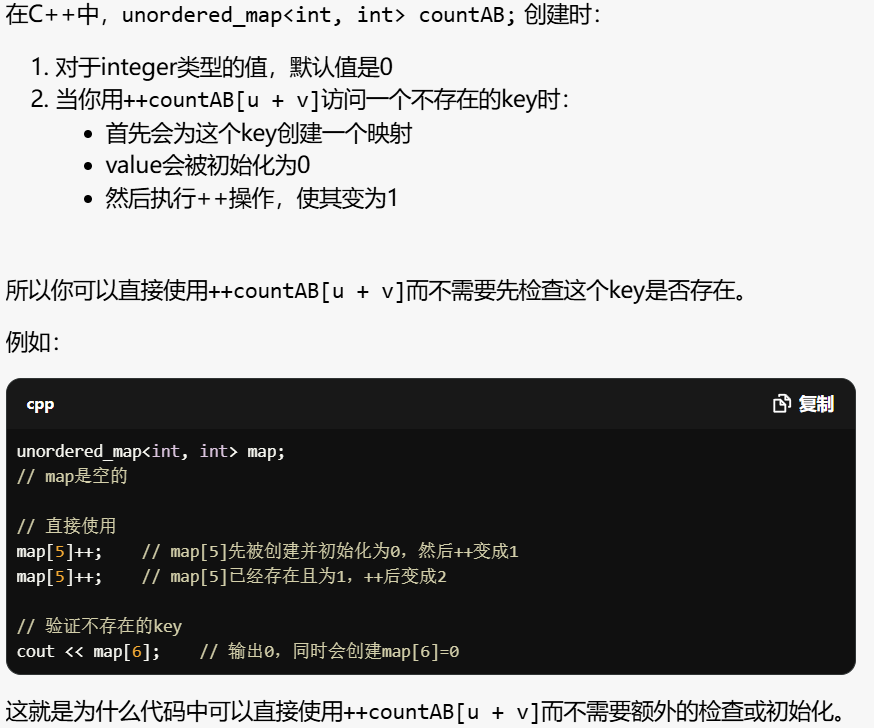

### [383. 赎金信](https://leetcode.cn/problems/ransom-note/)

Given two strings `ransomNote` and `magazine`, return `true` *if* `ransomNote` *can be constructed by using the letters from* `magazine` *and* `false` *otherwise*.

Each letter in `magazine` can only be used once in `ransomNote`.

思路参考[242. Valid Anagram](https://leetcode.cn/problems/valid-anagram/)，哈希

T=O(n),S=O(1)

```c++
class Solution {
public:
    bool canConstruct(string ransomNote, string magazine) {
        int record[26] = {0};
        if ( ransomNote.size() > magazine.size() ) {
            return false;
        }
        for ( int i = 0; i < magazine.length(); i++) {
            record[ magazine[i] - 'a' ]++;
        }
        for ( int j = 0; j < ransomNote.length(); j++ ) {
            record[ ransomNote[j] -'a' ]--;
            if ( record[ ransomNote[j] - 'a' ] < 0 ) {
                return false;
            }
        }
        return true;
    }
};
```


### [15.3Sum三数之和](https://leetcode.cn/problems/3sum/description/)

Given an integer array nums, return all the triplets `[nums[i], nums[j], nums[k]]` such that `i != j`, `i != k`, and `j != k`, and `nums[i] + nums[j] + nums[k] == 0`.

Notice that the solution set must not contain duplicate triplets.

排序后双指针判断

三数之和有一种直观的思路是先遍历两个数，然后加第三个数比较，过程中考虑去重，但这样时间复杂度比采用双指针高，双指针可从O(n^3)降到O(n^2)


T=O(n^2),S=O(1)

```c++
class Solution {
public:
    vector<vector<int>> threeSum(vector<int>& nums) {
        vector<vector<int>> result; // 默认情况下，result 是一个空的二维向量
        sort( nums.begin(), nums.end() );
        for ( int i = 0; i < nums.size(); i++ ) {
            // 排序之后第一个元素大于零，则不存在满足条件的三元组
            if ( nums[i] > 0 ) return result;
            if ( i > 0 && nums[i] == nums[i - 1] ) continue;
            int left = i + 1, right = nums.size() - 1;
            while ( right > left ) {
                if ( nums[i] + nums[left] + nums[right] >0 ) right--;
                else if ( nums[i] + nums[left] + nums[right] ) left++;
                else {
                    result.push_back( vector<int>{nums[i], nums[left], nums[right]} );
                    // 找到一个三元组后，对bc去重
                    while ( right > left && nums[ right ] == nums[ right - 1 ] ) right--;
                    while ( right > left && nums[ left ] == nums[ left + 1 ] ) left++;
                    right--;
                    left++;
                }
            }
        }
        return result;
    }
};
```


### [18. 4Sum四数之和](https://leetcode.cn/problems/4sum/)

Given an array `nums` of `n` integers, return *an array of all the **unique** quadruplets* `[nums[a], nums[b], nums[c], nums[d]]` such that:

*   `0 <= a, b, c, d < n`
*   `a`, `b`, `c`, and `d` are **distinct**.
*   `nums[a] + nums[b] + nums[c] + nums[d] == target`

You may return the answer in **any order**.

15.三数之和的双指针解法是一层for循环num[i]为确定值，然后循环内有left和right下标作为双指针，找到nums[i] + nums[left] + nums[right] == 0。

四数之和的双指针解法是两层for循环nums[k] + nums[i]为确定值，依然是循环内有left和right下标作为双指针，找出nums[k] + nums[i] + nums[left] + nums[right] == target的情况，三数之和的时间复杂度是O(n^2)，四数之和的时间复杂度是O(n^3) 。

T=O(n^3),S=O(1)

```c++
class Solution {
public:
    vector<vector<int>> fourSum(vector<int>& nums, int target) {
        vector<vector<int>> result;
        sort( nums.begin(), nums.end() );
        // nums: i, j, l, r
        for ( int i = 0; i < nums.size(); i++ ) {
            // 一个数构成的正数数组，提前剪枝
             // 这里和下面的break处理都是打破循环，统一在最后return
            if ( nums[i] > target && nums[i] >= 0 ) break; 
            // 去重
            if ( i > 0 && nums[i] == nums[ i - 1 ] ) continue;
            for ( int j = i + 1; j < nums.size(); j++ ) {
                // 两个数视角构成的正数数组，剪枝处理
                if ( nums[i] + nums[j] > target && nums[i] + nums[j] >= 0 ) break;
                if ( j > i + 1 && nums[j] == nums[j - 1] ) continue;
                // 双指针降低遍历的复杂度
                int l = j + 1, r = nums.size() - 1;
                while ( r > l ) {
                    // 用long存储四数之和，防溢出
                    if ( (long) nums[i] + nums[j] + nums[l] + nums[r] > target ) r--;
                    else if ( (long) nums[i] + nums[j] + nums[l] + nums[r] < target ) l++;
                    else {
                        result.push_back( vector<int>{nums[i], nums[j], nums[l], nums[r] } );
                        while ( r > l && nums[r] == nums[r-1] ) r--;
                        while ( r > l && nums[l] == nums[l+1] ) l++;
                        r--;
                        l++;
                    }
                }// while 
            }// for
        }// for
        return result;
    }
};
```

if ( nums[i] + nums[j] > target && nums[i] + nums[j] >= 0 ) break; 可优化为 if ( nums[i] + nums[j] > target && nums[i] >= 0 ) break; 因为是排序后的正数数组

# 字符串

## 字符串基础

### [344. Reverse String 反转字符串](https://leetcode.cn/problems/reverse-string/)

Write a function that reverses a string. The input string is given as an array of characters `s`.

You must do this by modifying the input array [in-place](https://en.wikipedia.org/wiki/In-place_algorithm) with `O(1)` extra memory.


双指针遍历一次即可

T=O(n), S=O(1)

```c++
class Solution {
public:
    void reverseString(vector<char>& s) {
        for ( int i = 0, j = s.size() - 1; i < s.size()/2; i++, j-- ) swap( s[i], s[j] );
        // 遍历条件也可以是while( i < j )
    }
};
```


#TODO 拔高：用递归实现，训练递归的思维


### [541. Reverse String II反转字符串II](https://leetcode.cn/problems/reverse-string-ii/)

Given a string `s` and an integer `k`, reverse the first `k` characters for every `2k` characters counting from the start of the string.

If there are fewer than `k` characters left, reverse all of them. If there are less than `2k` but greater than or equal to `k` characters, then reverse the first `k` characters and leave the other as original.

非常好的题目！！计算机编程思维比数学思维更好用！

T=O(n), S=O(1)

```c++
class Solution {
public:
    string reverseStr(string s, int k) {
        // reverse上一题已实现，直接使用库函数
        // 移动指针判断比较好，按数学规律处理麻烦
        for ( int i = 0; i < s.size(); i += (2 * k) ) {
            if ( i + k <= s.size() ) {
                reverse( s.begin() + i, s.begin() + i + k );
            } else {
                reverse( s.begin() + i, s.end() );
            }
        }// for
        return s;
    }
};
```


### [kama54替换数字](https://kamacoder.com/problempage.php?pid=1064)

给定一个字符串 s，它包含小写字母和数字字符，请编写一个函数，将字符串中的字母字符保持不变，而将每个数字字符替换为number。 例如，对于输入字符串 "a1b2c3"，函数应该将其转换为 "anumberbnumbercnumber"。


### [151. Reverse Words in a String反转字符串里的单词](https://leetcode.cn/problems/reverse-words-in-a-string/)

Given an input string `s`, reverse the order of the **words**.

A **word** is defined as a sequence of non-space characters. The **words** in `s` will be separated by at least one space.

Return *a string of the words in reverse order concatenated by a single space.*

**Note** that `s` may contain leading or trailing spaces or multiple spaces between two words. The returned string should only have a single space separating the words. Do not include any extra spaces.


```c++
class Solution {
public:
    // 去除字符串中多余空格的思路——覆盖式调整，将字符串规格化
    // 核心思路：“覆盖”
    void removeExtraSpaces( string& s ) {
        int slow = 0;
        // 在原来的字符串空间上操作: 取到原字符串内容+自己动手加空格==>规范化
        // (规范的字符串肯定小于等于原字符串)
        for ( int i = 0; i< s.size(); ++i ) {
            if ( s[i] != ' ' ) {
                if ( slow != 0 ) s[ slow++ ] = ' '; // 单词之间加空格
                while ( i < s.size() && s[i] != ' ' ) s[ slow++ ] = s[ i++ ];
            }//if
        }//for
        s.resize(slow);
    }

    void reverse(string& s, int start, int end){ //翻转，区间写法：左闭右闭 []
        for (int i = start, j = end; i < j; i++, j--) {
            swap(s[i], s[j]);
        }
    }

    string reverseWords(string s) {
        removeExtraSpaces(s);
        // reverse也可使用库函数
        reverse( s, 0, s.size()-1 );
        int start = 0;
        for ( int i = 0; i <= s.size(); ++i ) {
            if ( i == s.size() || s[i] == ' ') {
                reverse( s, start, i - 1);
                start = i + 1;
            }
        }//for
        return s;
    }
};
```


`std::string::resize` 是 C++ 标准库中 `std::string` 类的一个成员函数，用于调整字符串的大小。它可以用来增加或减少字符串的长度。以下是 `resize` 的详细用法和说明：

函数原型：

```
void resize(size_t n);               // 版本 1
void resize(size_t n, char c);       // 版本 2
```

参数：

1.  **`n`**：
    *   新的字符串大小（即字符的数量）。
    *   如果 `n` 小于当前字符串的大小，字符串会被截断，只保留前 `n` 个字符。
    *   如果 `n` 大于当前字符串的大小，字符串会被扩展，新增的部分用默认值填充（对于版本 1 是空字符 `'\0'`，对于版本 2 是字符 `c`）。
2.  **`c`**（可选）：
    *   当 `n` 大于当前字符串大小时，用于填充新增部分的字符。
    *   如果未提供此参数，则默认使用空字符 `'\0'`。


返回值：

*   无返回值（`void`）。


使用场景：

1.  **截断字符串**：

    *   如果 `n` 小于当前字符串的大小，字符串会被截断，只保留前 `n` 个字符。

    *   例如：

        cpp

        复制

        ```
        std::string s = "hello";
        s.resize(3); // s 变为 "hel"
        ```

2.  **扩展字符串**：

    *   如果 `n` 大于当前字符串的大小，字符串会被扩展，新增的部分用默认值填充。

    *   例如：

        cpp

        复制

        ```
        std::string s = "hello";
        s.resize(8); // s 变为 "hello\0\0\0"
        s.resize(8, '!'); // s 变为 "hello!!!"
        ```

3.  **清空字符串**：

    *   如果 `n` 为 0，字符串会被清空。

    *   例如：

        cpp

        复制

        ```
        std::string s = "hello";
        s.resize(0); // s 变为 ""
        ```

------

示例代码：

```
#include <iostream>
#include <string>

int main() {
    std::string s = "hello";

    // 截断字符串
    s.resize(3);
    std::cout << "\"" << s << "\"" << std::endl; // 输出: "hel"

    // 扩展字符串，默认填充空字符
    s.resize(6);
    std::cout << "\"" << s << "\"" << std::endl; // 输出: "hel\0\0\0"

    // 扩展字符串，填充指定字符
    s.resize(8, '!');
    std::cout << "\"" << s << "\"" << std::endl; // 输出: "hel\0\0\0!!"

    // 清空字符串
    s.resize(0);
    std::cout << "\"" << s << "\"" << std::endl; // 输出: ""

    return 0;
}
```

------

注意事项：

1.  **空字符 `'\0'`**：
    *   当使用 `resize` 扩展字符串时，如果未指定填充字符，默认会使用空字符 `'\0'`。
    *   空字符在 C++ 字符串中是一个有效的字符，但它不会在输出时显示。
2.  **性能**：
    *   `resize` 的时间复杂度通常是 O(n)，其中 n 是新的大小。
    *   如果扩展字符串，可能需要重新分配内存，这会导致额外的开销。
3.  **边界情况**：
    *   如果 `n` 大于当前字符串的容量（`capacity`），`resize` 会自动分配足够的内存。
    *   如果 `n` 小于当前字符串的大小，`resize` 不会释放多余的内存，只会调整字符串的长度。

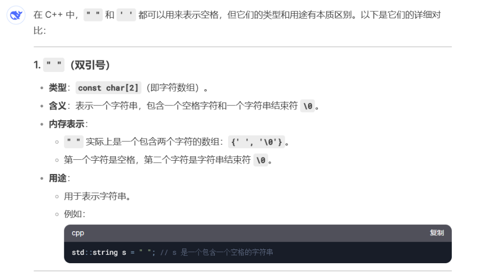

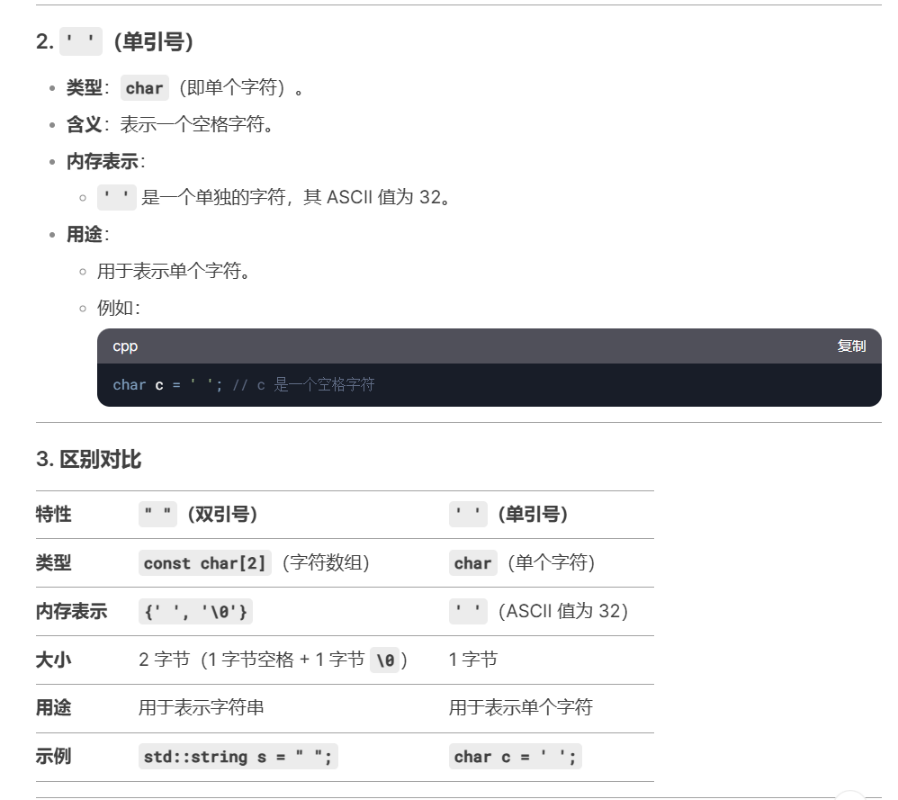

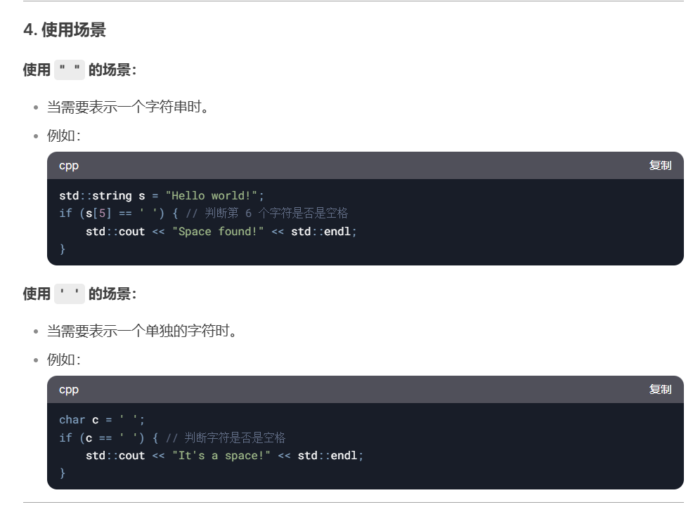


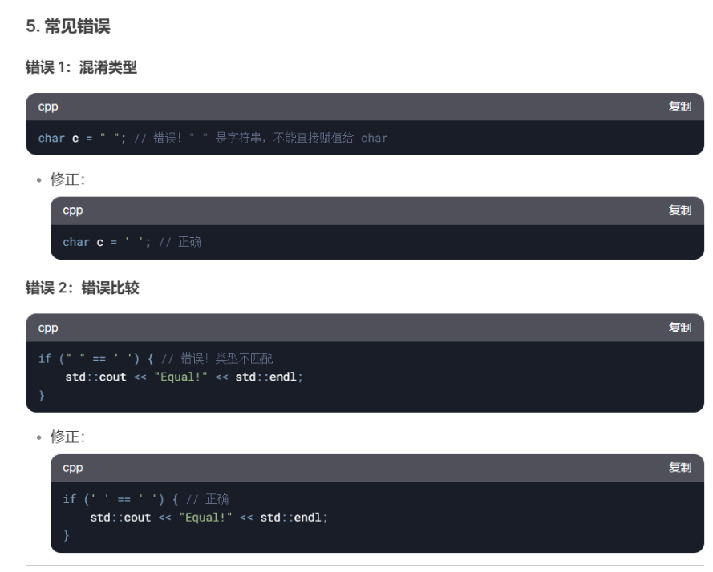

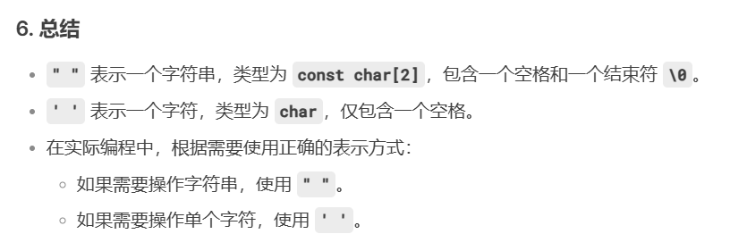


### [kama55.右旋转字符串](https://kamacoder.com/problempage.php?pid=1065)


### [28. 实现`strStr())`Find the Index of the First Occurrence in a String](https://leetcode.cn/problems/find-the-index-of-the-first-occurrence-in-a-string/)

#TODO about KMP


### [459. 重复的子字符串Repeated Substring Pattern](https://leetcode.cn/problems/repeated-substring-pattern/)

#TODO about KMP


## 模式串匹配


# 栈与队列

## 栈与队列基础

### [232. 用栈实现队列Implement Queue using Stacks](https://leetcode.cn/problems/implement-queue-using-stacks/)


T：都为O(1)；S：O(n)

peek()的实现，复用了pop()——代码开发的好习惯！

```c++
class MyQueue {
public:
    stack<int> stIn;
    stack<int> stOut;

    MyQueue() {
        
    }
    
    void push(int x) {
        stIn.push(x);
    }
    
    int pop() {
        if ( stOut.empty() ) {
            while ( !stIn.empty() ) {
                stOut.push( stIn.top() );
                stIn.pop();
            }//while
        }//if
        int res = stOut.top(); 
        stOut.pop();
        return res;
    }
    
    /*
    get the front element
    */
    int peek() {
        // 直接使用pop弹出元素返回，不同的是弹出的元素再压回去
        int res = this->pop();
        stOut.push(res);
        return res;
    }
    
    bool empty() {
        return stIn.empty() && stOut.empty();
    }
};

/**
 * Your MyQueue object will be instantiated and called as such:
 * MyQueue* obj = new MyQueue();
 * obj->push(x);
 * int param_2 = obj->pop();
 * int param_3 = obj->peek();
 * bool param_4 = obj->empty();
 */
```


### [225. 用队列实现栈Implement Stack using Queues](https://leetcode.cn/problems/implement-stack-using-queues/)
Implement a last-in-first-out (LIFO) stack using only two queues. The implemented stack should support all the functions of a normal stack (`push`, `top`, `pop`, and `empty`).

Implement the `MyStack` class:

*   `void push(int x)` Pushes element x to the top of the stack.
*   `int pop()` Removes the element on the top of the stack and returns it.
*   `int top()` Returns the element on the top of the stack.
*   `boolean empty()` Returns `true` if the stack is empty, `false` otherwise.

**Notes:**

*   You must use **only** standard operations of a queue, which means that only `push to back`, `peek/pop from front`, `size` and `is empty` operations are valid.
*   Depending on your language, the queue may not be supported natively. You may simulate a queue using a list or deque (double-ended queue) as long as you use only a queue's standard operations.


方法一：用两个队列模拟，一个为栈，一个作备份用

时间复杂度: pop为O(n)，top为O(n)，其他为O(1)

空间复杂度: O(n)

```c++
class MyStack {
public:
    queue<int> que1;
    queue<int> que2; // 辅助队列，备份用
    MyStack() {
        
    }
    
    void push(int x) {
        que1.push(x);
    }
    
    int pop() {
        int size = que1.size();
        size--; // que1中留一个元素, 这里如果写--size，只需while中（为了可读性）
        while( size-- ) { 
            que2.push( que1.front() );
            que1.pop();
        }
        int res = que1.front();
        que1.pop();
        que1 = que2;
        while ( !que2.empty() ) {
            que2.pop();
        }
        return res;
    }
    
    int top() { // 可以用que1.back()一句话实现，这里为了训练能力
        int size = que1.size();
        size--;
        while ( size-- ) {
            que2.push( que1.front() );
            que1.pop();
        }
        int res = que1.front();
        que2.push( que1.front() );
        que1.pop();

        que1 = que2;
        while ( !que2.empty() ) {
            que2.pop();
        }
        return res;
    }
    
    bool empty() {
        return que1.empty();
    }
};

/**
 * Your MyStack object will be instantiated and called as such:
 * MyStack* obj = new MyStack();
 * obj->push(x);
 * int param_2 = obj->pop();
 * int param_3 = obj->top();
 * bool param_4 = obj->empty();
 */
```


方法二：

时间复杂度: pop为O(n)，top为O(n)，其他为O(1)

空间复杂度: O(n)

```c++
//  方法二：一个队列，循环利用！
class MyStack {
public:
    queue<int> que;
    MyStack() {
        
    }
    
    void push(int x) {
        que.push(x);
    }
    
    int pop() {
        int size = que.size();
        size--;
        while ( size-- ) {
            que.push( que.front() );
            que.pop();
        }
        int res = que.front();
        que.pop();
        return res;
    }
    
    int top() {
        return que.back();
    }
    
    bool empty() {
        return que.empty();
    }
};
```


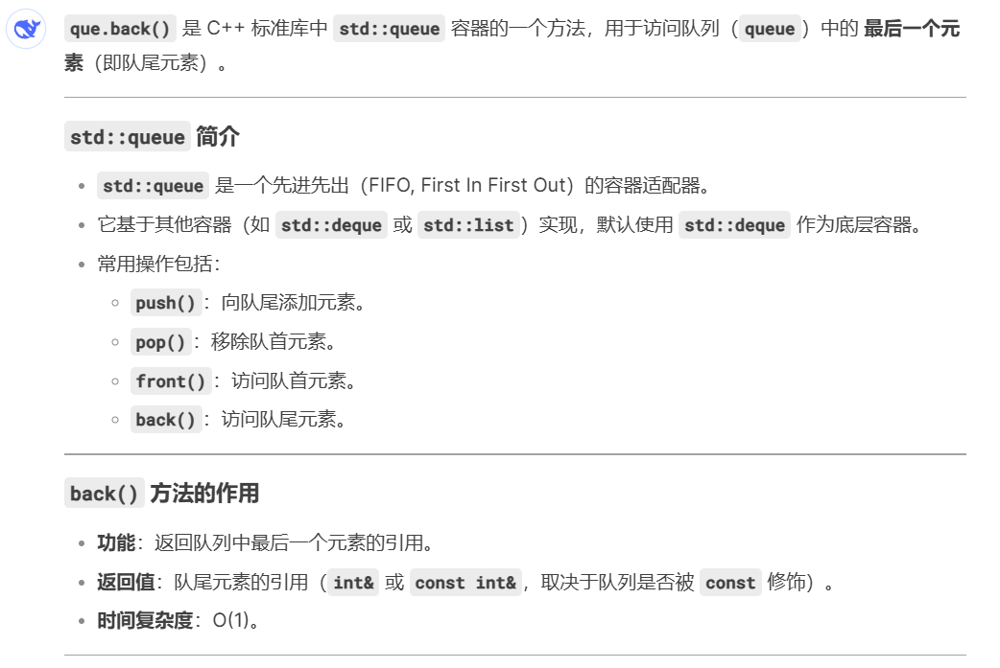


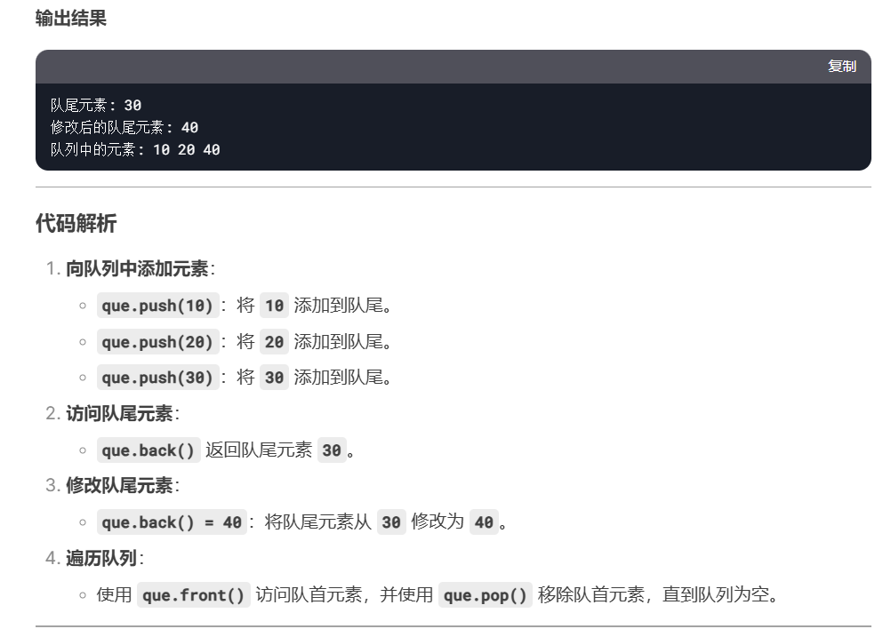

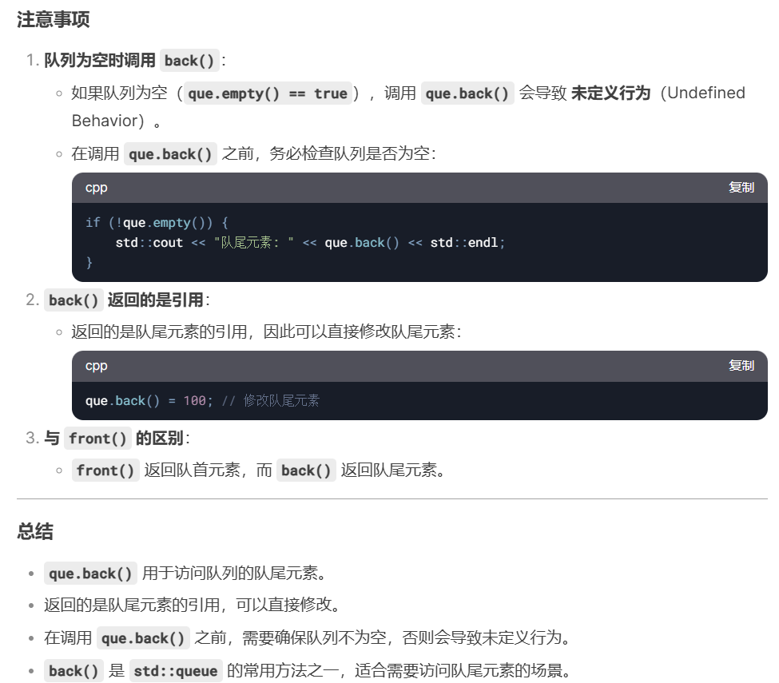


### [20. 有效的括号Valid Parentheses](https://leetcode.cn/problems/valid-parentheses/)


方法一：模拟法+栈

```c++
class Solution {
public:
    bool isValid(string s) {
        int n = s.size();
        if ( n % 2 != 0 ) return false;
        stack<char> st;
        for ( int i = 0; i < n; i++ ) {
            // also can use hash, key point is to think how to match 
            if ( s[i] == '(' ) st.push(')');
            else if ( s[i] == '[' ) st.push(']');
            else if ( s[i] == '{') st.push('}');
            // start match, case 1和2: 可能右方向的括号多余或类型不匹配
            else if ( st.empty() || st.top() != s[i] ) return false;
            // match success, pop
            else st.pop();
        } // for
        // case 3: 可能存在左方向括号没有匹配上
        return st.empty();
    }
};
```


方法二：哈希+栈，符号放在map中便于维护和扩展

https://leetcode.cn/problems/valid-parentheses/solutions/373578/you-xiao-de-gua-hao-by-leetcode-solution

```c++
class Solution {
public:
    bool isValid(string s) {
        int n = s.size();
        if ( n % 2 != 0 ) return false;

        // 方法二：哈希+栈，符号放在map中便于维护和扩展
        unordered_map<char, char> pairs = {
            {')', '('},
            {']', '['},
            {'}', '{'}
        };
        stack<char> stk;
        for (char ch: s) {
            if (pairs.count(ch)) {
                if (stk.empty() || stk.top() != pairs[ch]) {
                    return false;
                }
                stk.pop();
            }
            else {
                stk.push(ch);
            }
        }
        return stk.empty();
    }
};
```


pairs.count(ch):

 unordered_map 的一个成员函数。

 C++ 中用于**检查 `unordered_map` 中是否存在某个键**的方法。

具体来说，`pairs.count(ch)` 会返回 `unordered_map` 中键 `ch` 出现的次数。由于 `unordered_map` 中的键是唯一的，`count` 的返回值只能是 `0` 或 `1`。

*   如果 `pairs.count(ch)` 返回 `1`，表示 `ch` 是 `pairs` 中的一个键。
*   如果 `pairs.count(ch)` 返回 `0`，表示 `ch` 不是 `pairs` 中的键。


### [1047. 删除字符串中的所有相邻重复项Remove All Adjacent Duplicates In String](https://leetcode.cn/problems/remove-all-adjacent-duplicates-in-string/)


方法一：

C++ 代码中，由于 std::string 类本身就提供了类似「入栈」和「出栈」的接口，因此我们直接将需要被返回的字符串作为栈

```c++
class Solution {
public:
    string removeDuplicates(string s) {
        // 方法一：返回的字符串作为栈
        string res;
        for ( char ch : s ) {
            if ( res.empty() || res.back() != ch ) {
                res.push_back(ch);
            } else {
                res.pop_back();
            }//if
        }//for
        return res;

        // 方法二：利用栈中字符显式构造出返回的字符串（需要反转）
    }
};
```


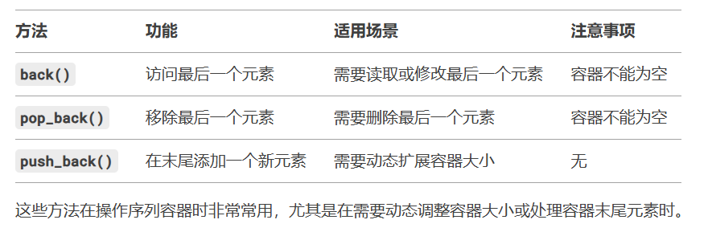

方法二：

遍历完成字符串后，使用栈中的字符显式地构造出需要被返回的字符串


### [150. Evaluate Reverse Polish Notation](https://leetcode.cn/problems/evaluate-reverse-polish-notation/)

You are given an array of strings `tokens` that represents an arithmetic expression in a [Reverse Polish Notation](http://en.wikipedia.org/wiki/Reverse_Polish_notation).

Evaluate the expression. Return *an integer that represents the value of the expression*.


逆波兰表达式相当于是二叉树中的后序遍历，把运算符作为中间节点，按照后序遍历的规则画出一个二叉树


```c++
class Solution {
public:
    int evalRPN(vector<string>& tokens) {
        // 1 <= tokens.length <= 1e4
        // tokens[i] 是一个算符（"+"、"-"、"*" 或 "/"），或是在范围 [-200, 200] 内的一个整数
        stack<long long> st;
        for ( int i = 0; i < tokens.size(); i++ ) {
            if ( tokens[i] == "+" || 
                 tokens[i] == "-" || 
                 tokens[i] == "*" ||
                 tokens[i] == "/" ) {
                long long nums1 = st.top();
                st.pop();
                long long nums2 = st.top();
                st.pop();
                // 先弹出的为右操作数
                if ( tokens[i] == "+" ) st.push( nums2 + nums1 );
                if ( tokens[i] == "-" ) st.push( nums2 - nums1 );
                if ( tokens[i] == "*" ) st.push( nums2 * nums1 );
                if ( tokens[i] == "/" ) st.push( nums2 / nums1 );
            } else {
                st.push( stoll( tokens[i] ) );
            }//if
        
        }//for
        long long result = st.top();
        st.pop();
        return result;
    }
};
```


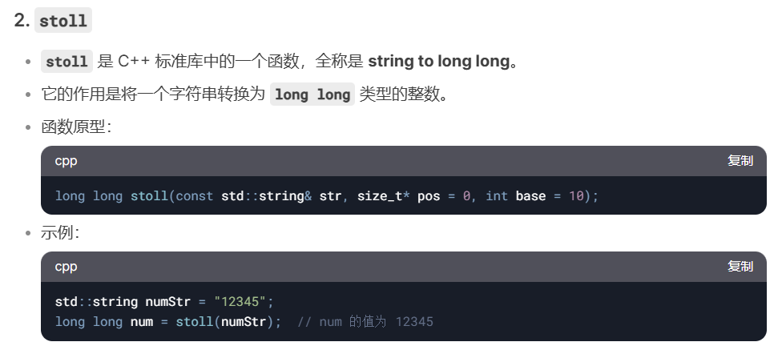

### [347. 前K个高频元素Top K Frequent Elements](https://leetcode.cn/problems/top-k-frequent-elements/)


## 单调栈、单调队列、优先队列

### [239. 滑动窗口最大值Sliding Window Maximum](https://leetcode.cn/problems/sliding-window-maximum/)


【单调队列 滑动窗口最大值【基础算法精讲 27】】 https://www.bilibili.com/video/BV1bM411X72E/

https://leetcode.cn/problems/sliding-window-maximum/solutions/2499715/shi-pin-yi-ge-shi-pin-miao-dong-dan-diao-ezj6

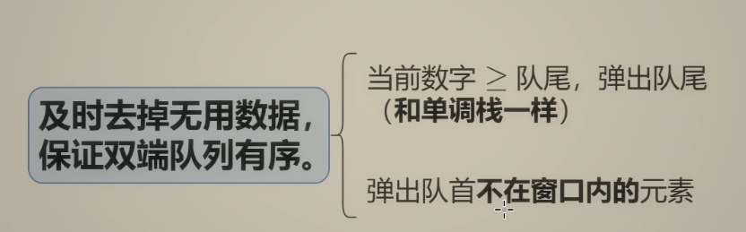


```c++
class Solution {
public:
    vector<int> maxSlidingWindow(vector<int>& nums, int k) {
        vector<int> ans;
        deque<int> q; // 双端队列
        for (int i = 0; i < nums.size(); i++) {
            // 1. 入
            while (!q.empty() && nums[q.back()] <= nums[i]) {
                q.pop_back(); // 维护 q 的单调性
            }
            q.push_back(i); // 入队
            // 2. 出
            if (i - q.front() >= k) { // 队首已经离开窗口了
                q.pop_front();
            }
            // 3. 记录答案
            if (i >= k - 1) {
                // 由于队首到队尾单调递减，所以窗口最大值就是队首
                ans.push_back(nums[q.front()]);
            }
        }
        return ans;
    }
};
```


### 每日温度

### 下一个更大元素I

### 下一个更大元素II

### 接雨水

### 柱状图中最大的矩形


# 树和堆


## 二叉树基础

*   解题过程中二叉树有两种主要的形式：满二叉树和完全二叉树

*   **堆就是一棵完全二叉树，同时保证父子节点的顺序关系**

*   **二叉搜索树是一个有序树**。

*   C++相关数据结构的底层实现：

    *   map、set、multimap，multiset的底层实现都是平衡二叉搜索树==>map、set的增删操作的时间复杂度是$\log n$
    *   unordered_map、unordered_set，unordered_map、unordered_set底层实现是哈希表

*   二叉树的定义

    ```c++
    struct TreeNode {
        int val;
        TreeNode *left;
        TreeNode *right;
        TreeNode(int x) : val(x), left(NULL), right(NULL) {}
    };
    ```

    

## 二叉树的遍历方式

*   二叉树主要有两种遍历方式：

    1.  深度优先遍历：先往深走，遇到叶子节点再往回走。
    2.  广度优先遍历：一层一层的去遍历。

    **这两种遍历是图论中最基本的两种遍历方式**，那么从深度优先遍历和广度优先遍历进一步拓展，才有如下遍历方式：

    *   深度优先遍历
        *   前序遍历（递归法，迭代法）
        *   中序遍历（递归法，迭代法）
        *   后序遍历（递归法，迭代法）
        *   拓展：Morris 遍历
    *   广度优先遍历
        *   层次遍历（迭代法）

*   深度优先遍历（前中后序遍历）通常使用递归法，递归的底层实现是**栈**，所以可以通过显式栈实现迭代法（非递归方式）

*   广度优先遍历的实现一般使用**队列**来实现

### [144. 二叉树的前序遍历Binary Tree Preorder Traversal](https://leetcode.cn/problems/binary-tree-preorder-traversal/)

Given the `root` of a binary tree, return *the preorder traversal of its nodes' values*.


#### 方法一：递归法


```c++
/**
 * Definition for a binary tree node.
 * struct TreeNode {
 *     int val;
 *     TreeNode *left;
 *     TreeNode *right;
 *     TreeNode() : val(0), left(nullptr), right(nullptr) {}
 *     TreeNode(int x) : val(x), left(nullptr), right(nullptr) {}
 *     TreeNode(int x, TreeNode *left, TreeNode *right) : val(x), left(left), right(right) {}
 * };
 */
class Solution {
public:
    void preorder( TreeNode *root, vector<int> &res ) {
        if ( root == nullptr ) return;
        res.push_back(root->val);
        preorder( root->left, res );
        preorder( root->right, res );
    }


    vector<int> preorderTraversal(TreeNode* root) {
        vector<int> res;
        preorder( root, res);
        return res;
    }
};
```

#### 方法二：迭代法


```c++
/**
 * Definition for a binary tree node.
 * struct TreeNode {
 *     int val;
 *     TreeNode *left;
 *     TreeNode *right;
 *     TreeNode() : val(0), left(nullptr), right(nullptr) {}
 *     TreeNode(int x) : val(x), left(nullptr), right(nullptr) {}
 *     TreeNode(int x, TreeNode *left, TreeNode *right) : val(x), left(left), right(right) {}
 * };
 */
class Solution {
public:
    // 方法二：迭代法
    vector<int> preorderTraversal(TreeNode* root) {
        stack<TreeNode*> st;
        vector<int> res;
        if ( root == nullptr ) return res;
        st.push(root);
        while ( !st.empty() ) {
            TreeNode* node = st.top();
            st.pop();
            res.push_back( node->val );
            if ( node->right ) st.push( node->right); // 右边先入栈
            if ( node->left ) st.push( node->left );
        }// while
        return res;
    }
};
```


### [145. 二叉树的后序遍历Binary Tree Postorder Traversal](https://leetcode.cn/problems/binary-tree-postorder-traversal/)


#### 方法一：递归法


```c++
class Solution {
public:
    // 方法一：递归法
    void postorder( TreeNode *root, vector<int> &res ){
        if ( root == nullptr ) return;
        postorder( root->left, res );
        postorder( root->right, res );
        res.push_back( root->val );
    }

    vector<int> postorderTraversal(TreeNode* root) {
        vector<int> res;
        postorder( root, res );
        return res;
    }
};
```


#### 方法二：迭代法

```c++

```


### [94.二叉树的中序遍历Binary Tree Inorder Traversal](https://leetcode.cn/problems/binary-tree-inorder-traversal/)

#### 方法一：递归法

```c++
class Solution {
public:
    // 方法一：递归法
    void inorder( TreeNode* root, vector<int>& res ) {
        if ( !root ) return;
        inorder( root->left, res );
        res.push_back( root->val );
        inorder( root->right, res );
    }

    vector<int> inorderTraversal(TreeNode* root) {
        vector<int> res;
        // 写递归程序时，是特意写一段函数，划定递归区，有点OS中临界区的感觉
        inorder( root, res );
        return res;
    }
};
```


#### 方法二：迭代法


```c++

```


### 二叉树的层序遍历


```c++

```


## 二叉树的属性

### 对称二叉树

### 二叉树的最大深度

### 二叉树的最小深度

### 完全二叉树的节点个数

### 平衡二叉树

### 二叉树的所有路径

### 左叶子之和

### 找树左下角的值

### 路径总和


## 二叉树的修改与构造

### 翻转二叉树

### 从中序与后序遍历序列构造二叉树

### 最大二叉树

### 合并二叉树


## 求二叉搜索树BST的属性

### 二叉搜索树中的搜索

### 验证二叉搜索树

### 二叉搜索树的最小绝对差

### 二叉搜索树中的众数


## 二叉树公共祖先问题

### 二叉树的最近公共祖先

### 二叉搜索树的最近公共祖先


## 二叉搜索树的修改与构造

### 二叉搜索树中的插入操作

### 删除二叉搜索树中的节点

### 修剪二叉搜索树

### 将有序数组转换为二叉搜索树

### 把二叉搜索树转换为累加树


---


### 线段树

### 树状数组

### 并查集

### AVL树*

### 红黑树、B树、B+树*

# 图

## 图基础

## 图的遍历


## 生成树

## 最短路径


## 二分图


*   所有可能的路径

*   岛屿数量.深搜版

*   岛屿数量.广搜版

*   岛屿的最大面积

*   飞地的数量

*   被围绕的区域

*   太平洋大西洋水流问题

*   最大人工岛

*   单词接龙

*   钥匙和房间

*   岛屿的周长

*   并查集理论基础

*   寻找图中是否存在路径

*   冗余连接

*   冗余连接II 

*   最小生成树之prim

*   最小生成树之Kruskal

*   拓扑排序

*   Dijkstra朴素版

*   Dijkstra堆优化版

*   Bellman ford算法

*   SPFA算法

*   Bellman ford之判断负权回路

*   Bellman ford之单源有限最短路

*   Floyd算法

*   A*算法


# 算法基础

## 枚举

## 递归

## 分治

## 回溯

*   回溯算法理论基础

*   组合问题

*   组合（优化）

*   组合总和III

*   电话号码的字母组合

*   回溯周末总结

*   组合总和

*   组合总和II

*   分割回文串

*   复原IP地址

*   子集问题

*   回溯周末总结

*   子集II

*   递增子序列

*   全排列

*   全排列II

*   回溯周末总结

*   回溯算法去重问题的另一种写法

*   重新安排行程

*   N皇后

*   解数独

*   回溯法总结篇


## 贪心

*   贪心算法理论基础

*   分发饼干

*   摆动序列

*   最大子序和

*   贪心周总结

*   买卖股票的最佳时机II

*   跳跃游戏

*   跳跃游戏II

*   K次取反后最大化的数组和

*   贪心周总结

*   加油站

*   分发糖果

*   柠檬水找零

*   根据身高重建队列

*   贪心周总结

*   根据身高重建队列（vector原理讲解）

*   用最少数量的箭引爆气球

*   无重叠区间

*   划分字母区间

*   合并区间

*   贪心周总结

*   单调递增的数字

*   监控二叉树


## 位运算


# 动态规划

## 斐波那契数

## 爬楼梯

## 使用最小花费爬楼梯


## 不同路径

## 不同路径II

## 整数拆分

## 不同的二叉搜索树


## 0-1背包理论基础

## 分割等和子集

## 最后一块石头的重量II


## 目标和

## 一和零

## 完全背包理论基础

## 零钱兑换II


## 组合总和Ⅳ

## 爬楼梯（进阶版）

## 零钱兑换

## 完全平方数

## 单词拆分

## 多重背包理论基础

## 背包问题总结篇

## 打家劫舍

## 打家劫舍II

## 打家劫舍III

## 买卖股票的最佳时机

## 动规周总结

## 买卖股票的最佳时机II

## 买卖股票的最佳时机III

## 买卖股票的最佳时机IV

## 最佳买卖股票时机含冷冻期

## 动规周总结

## 买卖股票的最佳时机含手续费

## 股票问题总结篇

## 最长上升子序列

## 最长连续递增序列

## 最长重复子数组

## 最长公共子序列

## 不相交的线

## 最大子序和

## 判断子序列

## 不同的子序列

## 两个字符串的删除操作

## 编辑距离

## 编辑距离总结篇

## 回文子串

## 最长回文子序列

## 动态规划总结篇


# 模拟机试


## BDAA2024-校内保研机试

### 质因数分解

贡献者Double680

#### 题目描述

给定两个大小分别为 m和n的正序数组 `nums1` 和 `nums2` ，其中 0≤m≤1000，0≤n≤10000≤*m*≤1000，0≤*n*≤1000。请你找出并分别返回这两个正序数组的中位数。

已知一个正整数n*n*可以表示为两个不同质数的乘积，求其中较大的那个质数。

#### 样例示例

时间限制：1s
空间限制：256 MB

#### 输入描述

共一行，输入一个正整数n*n*。

#### 输出描述

共一行，一个正整数，表示较大的那个质数。

#### 数据范围

对于40%40%的数据，n≤1000*n*≤1000。
对于100%100%的数据，n≤1014*n*≤1014。

#### 样例输入

```
21
```

#### 样例输出

```
7
```

#### 样例输入

```
998
```

#### 样例输出

```
499
```

#### 样例输入

```
24777978211501
```

#### 样例输出

```
10038467
```

### 整数合成

贡献者Double680

#### 题目描述

给定一个非负整数组，对于一个正整数x*x*，如果在这个数组中存在若干个不同位置的元素，使得它们经过或（oror）运算得到的结果恰好等于x*x*，则称x*x*是**可合成的**。

求给定整数组不可合成的最小正整数。

#### 输入描述

第一行一个整数n*n*，表示数组长度。

接下来一行n*n*个用空格隔开的非负整数x1,x2,…,xn*x*1,*x*2,…,*x**n*，表示数组的各个元素。

#### 输出描述

输出一个整数，表示所求不能合成的最小正整数。

#### 数据说明

对于100%100%的数据，n≤104*n*≤104，xi≤106*x**i*≤106。

#### 样例输入

```
3
2 1 3
```

#### 样例输出

```
4
```

### 摸球

贡献者Double680

#### 题目描述

箱子里有n*n*个红球和m*m*个黑球。现采用不放回的方式随机依次从箱子里摸球，求摸到第一个黑球时，已摸到红球的期望数量。

#### 输入描述

输入一行两个正整数n,m*n*,*m*，分别表示红球数和黑球数。

#### 输出描述

输出一行一个实数，表示所要求的期望答案，结果四舍五入保留3位小数。

#### 数据范围

对于30%30%的数据，1≤n≤21≤*n*≤2。
对于60%60%的数据，1≤n,m≤1051≤*n*,*m*≤105。
对于100%100%的数据，1≤n,m≤1091≤*n*,*m*≤109。

#### 样例输入

```
1 3
```

#### 样例输出

```
0.250
```

### 扫雷

贡献者Double680

#### 题目描述

在一场战争中，A国派出了一名工兵前往一个重要据点进行扫雷，以方便后续部队的推进。

具体而言，在一个平面上有n*n*个坐标已知的地雷，工兵位于坐标原点(0,0)(0,0)，为了节省体力，他希望能行进最短的距离以扫清所有地雷。

请你求出扫清所有地雷所需行进的最短距离。

#### 输入描述

输入第一行一个整数n*n*，表示地雷个数。
接下来n*n*行，每行两个实数xi,yi*x**i*,*y**i*表示地雷i*i*的平面坐标。

#### 输出描述

输出一个实数，表示所求最短距离，结果保留两位小数。

#### 数据说明

对于30%30%的数据，1≤n≤81≤*n*≤8。
对于100%100%的数据，1≤n≤151≤*n*≤15，∣xi∣,∣yi∣≤200∣*x**i*∣,∣*y**i*∣≤200。

#### 样例输入

```
4
1 1
1 -1
-1 1
-1 -1
```

#### 样例输出

```
7.41
```


## 软件设置与上机环境
